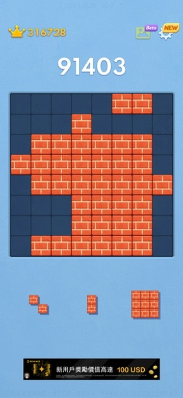
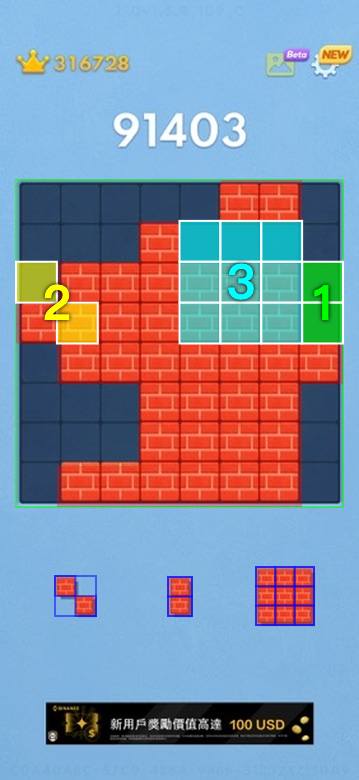

# Tetris Variant AI Solver

A pure frontend, zero-server AI solver for variant Tetris mobile games. Paste a screenshot of your game, and it will instantly parse the board, extract the pieces, and calculate the optimal placement sequence using a survival-focused Depth-First Search (DFS) algorithm.

🌐 **[Try it out live here!](https://fun.gowilli.xyz/tetris)**

## Demo

<div align="center">
  
  
</div>

## Features

- **100% Client-Side**: No backend required. Uses HTML5 `<canvas>` for blazingly fast image processing right in your browser.
- **Dynamic Skin Adaptation**: Automatically detects the board and piece colors using a Global Sampling Clustering algorithm. It works flawlessly across different game skins (dark, light, wood, pink, etc.) and ignores background gradients or ads.
- **Robust Piece Extraction**: Uses a GCD-based heuristic and multi-point sampling to perfectly extract irregular pieces (like 3x3 L-shapes, 1x4 bars) regardless of their scaling.
- **Survival-First AI**: The solver prioritizes survival over high scores. Its heuristic evaluation function heavily penalizes enclosed "holes", ensuring you stay alive as long as possible.

## How to use

1. Open the [web app](https://fun.gowilli.xyz/tetris).
2. Take a screenshot of your active game.
3. Simply press `Ctrl + V` (or `Cmd + V` on Mac) to paste the image into the page.
4. The AI will overlay the best placements labeled `1`, `2`, and `3` directly onto your screenshot.

## Local Development

```bash
# Install dependencies
npm install

# Start the dev server
npm run dev

# Run unit tests (testing the computer vision accuracy against sample screenshots)
npm run test
```

## Tech Stack

- **React 19** + **TypeScript** + **Vite**
- **Tailwind CSS** + **Lucide React** for styling and icons.
- **Vitest** for Computer Vision unit testing.
